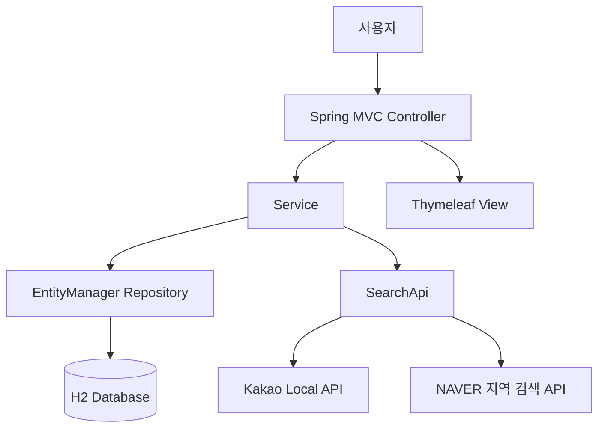

# WORK SPOT

> 외부 지역 검색 API를 활용해 작업하기 좋은 장소를 검색하고, 사용자별 아지트와 리뷰로 관리하는 Spring MVC 기반 웹 애플리케이션

## 1. 프로젝트 소개

WORK SPOT은 카페와 공유 오피스처럼 사용자가 작업하기 좋은 장소를 검색하고, 자주 이용하는 장소를 자신만의 **아지트**로 저장하거나 리뷰를 남길 수 있는 1인 토이 프로젝트입니다.

Spring Boot와 JPA의 기본 구조를 실제 기능에 적용하고, 외부 API의 응답을 애플리케이션의 DTO와 엔티티로 변환하는 전체 데이터 흐름을 학습하기 위해 개발했습니다.

### 개발 목표

- Spring MVC의 Controller-Service-Repository 계층 이해
- JPA 엔티티와 연관관계를 활용한 도메인 모델링
- 외부 Open API 요청·응답 처리와 JSON 역직렬화
- 외부 데이터와 내부 도메인 모델의 분리
- API 구현체 교체에 대응할 수 있는 추상화 경험

## 2. 기술 스택

| 구분 | 기술 |
| --- | --- |
| Language | Java 17 |
| Framework | Spring Boot 4.0.1, Spring MVC |
| Persistence | JPA, Hibernate, JPQL |
| View | Thymeleaf, Bootstrap |
| Database | H2 Database |
| External API | Kakao Local API, NAVER 지역 검색 API |
| Data Processing | Jackson ObjectMapper |
| Validation | Jakarta Bean Validation |
| Build | Gradle 9.2.1 |
| Etc. | Lombok, p6spy |

## 3. 주요 기능

### 장소 검색

- 검색어를 Kakao Local API 또는 NAVER 지역 검색 API로 전달
- JSON 응답을 API별 응답 객체로 역직렬화
- 외부 응답을 화면과 서비스에서 사용하는 검색 DTO로 변환
- 장소명, 카테고리, 주소, 전화번호와 좌표 정보 제공

현재 서비스의 기본 구현체는 `@Primary`로 지정된 `KakaoApiClient`입니다.

### 필요한 시점에만 장소 저장

- 검색 결과 전체를 DB에 즉시 저장하지 않음
- 사용자가 상세보기를 선택하거나 리뷰 작성을 시작할 때만 `Spot` 엔티티로 변환
- 외부 API가 제공한 장소 ID를 `uniqueId`로 사용해 중복 저장 방지

### 사용자와 아지트

- 사용자 등록 및 목록 조회
- 검색한 장소를 사용자별 아지트로 등록
- 사용자와 장소의 조합을 확인해 동일한 아지트의 중복 등록 방지
- 아지트별 별칭, 콘센트 유무와 메모 저장

### 리뷰

- 사용자와 장소를 선택해 리뷰 작성
- 전체 리뷰 및 리뷰 상세 조회
- 작성자 닉네임을 기준으로 리뷰 검색
- 작성 시각을 기준으로 최신순 정렬
- 리뷰 등록 후 홈으로 리다이렉트하는 PRG 패턴 적용

## 4. 애플리케이션 구조



```text
src/main/java/toyproject/workspot
├── controller       # 요청 처리, Form 및 검색 DTO
├── service          # 트랜잭션과 비즈니스 로직
├── Repository       # EntityManager 기반 데이터 접근
├── domain           # User, Spot, Agite, Review
└── infrastructure   # SearchApi와 외부 API 구현체
    ├── kakao
    └── naver
```

## 5. 핵심 기술적 경험

### 5.1 외부 API 구현체 추상화

처음에는 NAVER 지역 검색 API를 사용했지만 검색 결과 수와 제공 정보에 한계가 있어 Kakao Local API를 추가했습니다. 이 과정에서 서비스가 특정 API 클라이언트에 직접 의존하면 API를 교체할 때 호출부까지 함께 수정해야 한다는 문제를 경험했습니다.

이를 개선하기 위해 공통 호출 계약인 `SearchApi` 인터페이스를 정의하고, `NaverApiClient`와 `KakaoApiClient`가 이를 각각 구현하도록 구성했습니다.

```java
public interface SearchApi {
    String searchLocal(String keyword);
}
```

외부 API를 호출하는 책임을 `infrastructure` 계층으로 분리하고, 서비스는 인터페이스를 주입받도록 만들어 구현체 선택에 대한 결합도를 낮췄습니다.

### 5.2 외부 응답과 내부 도메인 분리

외부 API마다 응답 필드와 JSON 구조가 다르기 때문에 응답 객체를 내부 엔티티로 바로 사용하지 않았습니다.

```text
외부 API JSON
    → API별 Response DTO
    → 서비스용 SpotSearchDto
    → 필요한 시점에 Spot Entity
    → DB 저장
```

### 5.3 저장 시점 분리와 중복 방지

검색 결과는 사용자가 실제로 선택하지 않을 수도 있으므로 모든 결과를 저장하면 불필요한 데이터가 쌓일 수 있습니다. 따라서 검색 단계에서는 DTO만 반환하고, 상세보기나 리뷰 작성을 위해 장소가 선택된 시점에만 엔티티로 변환합니다.

저장 전에는 외부 장소 ID로 기존 `Spot`을 조회하고, 존재하지 않을 때만 새 엔티티를 저장합니다.

## 6. 주요 화면 흐름

| 기능 | Method | URL |
| --- | --- | --- |
| 홈 | GET | `/` |
| 사용자 등록 | GET, POST | `/user/new` |
| 사용자 목록 | GET | `/users` |
| 장소 검색 | GET, POST | `/spot/searchWord` |
| 장소 상세 및 저장 | POST | `/spot/detail` |
| 아지트 사용자 선택 | GET | `/agite/chooseUser` |
| 아지트 등록 | POST | `/agite/add`, `/agite/new` |
| 아지트 목록 | POST | `/agite/list` |
| 리뷰 작성 흐름 | GET, POST | `/review/chooseUser`, `/review/searchSpot/{userId}`, `/review/new` |
| 리뷰 목록 | GET | `/review/reviews` |
| 리뷰 상세 | GET | `/review/{reviewId}` |


## 7. 배운 점

- 외부 API를 연동할 때는 호출 성공뿐 아니라 응답을 내부 모델로 어떻게 변환할지 설계해야 한다는 점
- 구현체 교체 가능성을 고려해 인터페이스에 의존하는 구조가 필요하다는 점
- 외부 검색 결과와 영속화할 엔티티를 분리하고 저장 시점을 명확히 해야 한다는 점
- 트랜잭션 범위와 JPQL을 실제 비즈니스 규칙에 연결하는 방법
- 기능 구현 이후에도 실행 환경, 테스트 가능성, DB 제약까지 함께 설계해야 한다는 점
